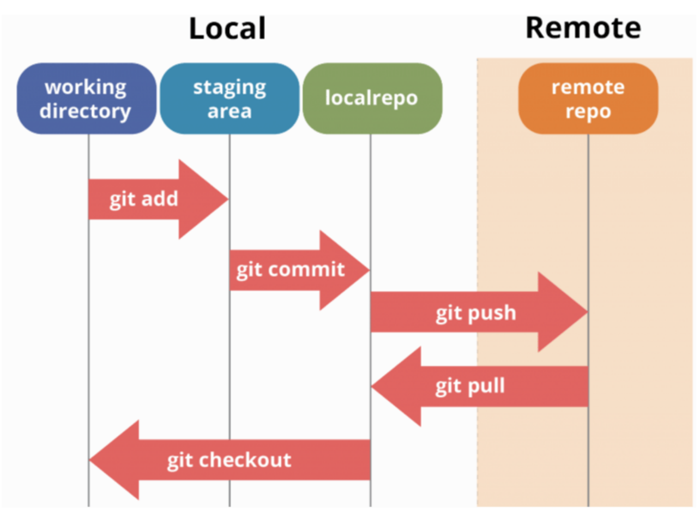

# Git cheatsheet

## Table of Contents

 - [Initial setup of Git on a new system](#initial-setup-of-git-on-a-new-system)
 - [Getting started](#getting-started)
 - [Using multiple accounts on same computer](#using-multiple-accounts-on-same-computer)
 - [Basic Git work flow](#basic-git-work-flow)

## Initial setup of Git on a new system
### Configure user information

```bash
git config --global user.name "[Firstname Lastname]"
git config --global user.email "[Valid-email]"
```

### Setup ssh key, first check if there is an existing ssh key
```bash
ls ~/.ssh
```
### If not, generate key type Ed25519
```bash
ssh-keygen -t ed25519 -C "your_email@example.com"
```
### Print public key and manually copy to your GitHub profile's ssh key
```bash
cat ~/.ssh/id_ed25519.pub
```


## Getting started
### Frist go to the github website of the repository that you want to contribute to and copy the SSH or HTTPS link, for e.g.
```bash
git clone https://github.com/FahYen/EngineeringNotes.git
```
### By default you're on main branch of the repository, you want to start a new branch for your work, do
```bash
git checkout feature_branch
```


## Using multiple accounts on same computer
### Assuming you already set up SSH key for first GitHub account, create a new SSH key for different account
```bash
ssh-keygen -t rsa -b 4096 -C "enter-your-email-address-linked-with-Github-account-here"
```
### The output will look like this:
```bash
Generating public/private rsa key pair.
Enter file in which to save the key (/home/kallen/.ssh/id_rsa):
```
### Instead of saving to id\_rsa (default personal account) change file name.
### For example, to change to name it in file id\_rsa\_kallen:
```bash
Enter file in which to save the key (/home/kallen/.ssh/id_rsa): /home/kallen/.ssh/id_rsa_kallen
```
### Afterwards you get the typical prompt to enter a passphrase.
```bash
Enter passphrase (empty for no passphrase)
```
### You will be prompted to enter the passphrase again.
```bash
Enter same passphrase again (empty for no passphrase):
```
### Now two files (public and private keys) have been created in the location you specified. Output public key with
```bash
cat .ssh/id_rsa_kallen.pub
```
### Manually copy the output and add the key in your desired GitHub account. Go to profile picture >> Settings >> SSH and GPG keys
### Add key to SSH
```bash
$ ssh-add ~/.ssh/id_rsa_kallen
Enter passphrase for /home/kallen/.ssh/id_rsa_kallen:
Identity added: /home/kallen/.ssh/id_rsa_kallen (kallen@gmail.com)
```
### If successfully added, a line stating Identity Added will appear
### To specify which account you want to push from, create a config file in .ssh folder
```bash
touch ~/.ssh/config
vim config
```
### Paste the following:
```bash
# Default GitHub
Host github.com
   HostName github.com
   User git
   IdentityFile ~/.ssh/id_rsa
```
### This is the default for pushing to the primary GitHub account. Copy and modify this default snippet so you have changed the Host and IdentityFile
### For example, Host is changed to github-kallen.com and IdentityFile is ~/.ssh/id\_rsa\_kallen:
```bash
Host github-kallen.com
   HostName github.com
   User git
   IdentityFile ~/.ssh/id_rsa_kallen
```
### When you want to push from this account make sure git remote is set with this Host
### For example, setting origin to FahYen/EngineeringNotes.git with previous config identity for kallen:
```bash
git remote add origin git@github-kallen.com:FahYen/EngineeringNotes.git
```
### If you have configured git to use a global email and user name, set the email for this repository so the correct acount shows
```bash
git config user.email "set-desired-GitHub-email-here"
```
### Now when you push to this repository, the correct account should display

## Basic Git work flow


## 'git add'
Git add specifies what changes are staged for the next commit.
### Add all changes in current working directory except files specified by .gitignore
```bash
git add .
```
### .gitignore example
.gitignore can be in any directory in the repository, each one applies to its directory and all subdirectories below it. The glob pattern assume the working directory to be the location of .gitignore.
```bash
# Ignore everything
*

# But not these files...
!.gitignore
!README.md

# But ./src/ itself
!src/
# And everything in ./src/ recursively
!src/**
```
### git add specifics
```bash
# Add src directory in current working directory
git add src/
# Equivalaent to
git add ./src/
# Add with absolute path
git add /home/user/project/src/file.js
# Add all python files in .src/
git add src/*.py
```
## 'git commit'
Create a "commit" or a snapshot of repository of everything that's staged.
## 'git push'
Apply local commits to the remote repository
```bash
git push
# Equivalent to
git push orgin
# You can also do
git push upstream
# if you have an upstream, if you were forking another repository
```
```bash
git checkout main
git pull
git checkout feature_branch
git rebase main
git checkout main
git merge feature_branch
git push
```